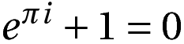

texscrap
========
`texscrap` is a Python utility from turning snippets of LaTeX--either files (via `--file`) or equations (via `--equation`)---into tightly bound stand-alone PDFs. 
Optionally, you can also create PNGs, via the `--png` flag. 
The resultant files are written the directory the script is called from. 

The primary use case is creating image files for inclusion in a presentation or blog post. 
Even if you are using a Beamer class for presentations, it is often useful to include images of tables and equations rather than the actual TeX since the re-sizing options are more flexible. 

Example
-------
To render an equation, we can run: 

    texscrap -e "e^{\pi i} + 1 = 0"

will generate a PDF file that looks like this: 



if you want a PNG file as well, you can just add a `--png` flag i.e..,

    texscrap --png -e "e^{\pi i} + 1 = 0"

To install
----------

    git clone git@github.com:johnjosephhorton/texscrap.git
    cd texscrap
    sudo python setup.py install 

In addition to `jinja2`, this script also requires [pdflatex](http://www.tug.org/applications/pdftex/), [ImageMagick](http://www.imagemagick.org/script/index.php) and [pdfcrop](http://www.ctan.org/pkg/pdfcrop).  

Rendering a collection of equations in batch
--------------------------------------------
You can render a bunch of equations in batch. Suppose you have file `multiline.txt` with your equations: 

    cat multiline.txt
    x^2 + 3x
    \int x^2 dx
    \log x

To create files for each, you can run:

    <multiline.txt xargs -I % texscrap -e "%"

    
Building from a file
--------------------
You can also build from a file, like so: 

    texscrap -f <name of latex file.tex> 


Building from standard input
----------------------------

    echo "hello world" | texscrap 

which will produce a pdf file called `stdin_file_<seconds from unix epoch>.pdf` in the directory. 


Changing the LaTeX packages installed
--------------------------------------

The actual LaTeX "wrapper" is in the directory `./templates` and can be easily modified with the pacakges you need. 


Documentation
-------------
```
usage: texscrap.py [-h] [-f FILE] [-e EQUATION] [--png]

Runs pdflatex on a LaTeX file that lacks a header and returns a tightly
cropped PDF, and optionally, a PNG file. Can also run on a quoted LaTeX
equation

optional arguments:
  -h, --help            show this help message and exit
  -f FILE, --file FILE  File to render
  -e EQUATION, --equation EQUATION
                        Equation to render
  --png                 Creat a companion PNG file.
```
